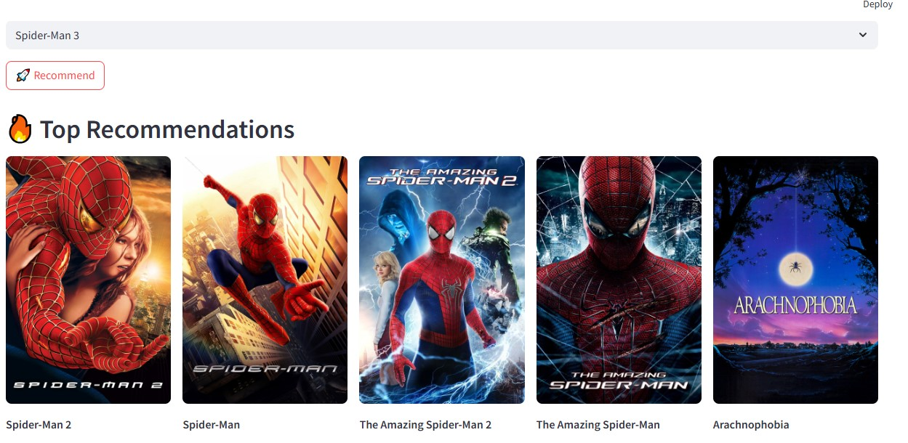

# 🎬 Movie Recommender System
A content-based movie recommendation web app built using **Machine Learning** and **Streamlit**.
It suggests movies similar to your selected movie using similarity scores and displays posters using the TMDb API.

---
## 🚀 Features
*  Recommend similar movies instantly
*  Content-based filtering using TF-IDF & Cosine Similarity
*  Movie posters fetched dynamically via TMDb API
*  Fast and interactive UI using Streamlit
*  Clean and user-friendly interface

---

##  Tech Stack
* Python
* Pandas
* Scikit-learn
* Streamlit
* Pickle
* Requests (API calls)

---
##  Project Structure
📁 Movie-Recommender-System
│── app.py
│── movie_list.pkl
│── similarity.pkl
│── requirements.txt
│── README.md

---
##  Installation & Setup

### 1️⃣ Clone the repository

```bash
git clone https://github.com/Navadeep73/movie-reccomender-system.git
cd movie-recommender-system
```

### 2️⃣ Install dependencies

```bash
pip install -r requirements.txt
```

### 3️⃣ Add your TMDb API Key

Open `app.py` and replace:

```python
API_KEY = "YOUR_API_KEY_HERE"
```


### 4️⃣ Run the app

```bash
streamlit run app.py
```

---

##  How It Works

* Dataset is preprocessed and converted into feature vectors using **TF-IDF**
* Cosine similarity is calculated between movies
* When a user selects a movie:

  * The system finds the most similar movies
  * Fetches posters using TMDb API
  * Displays top 5 recommendations

## 📸 Screenshot


## Try the App :
https://huggingface.co/spaces/navadeep73/movie-reccomender-system
